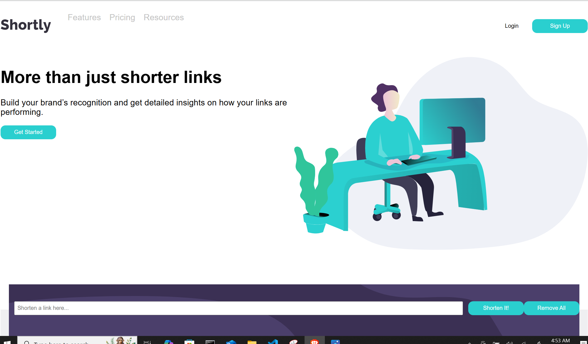

# Frontend Mentor - Shortly URL shortening API Challenge solution

This is a solution to the [Shortly URL shortening API Challenge challenge on Frontend Mentor](https://www.frontendmentor.io/challenges/url-shortening-api-landing-page-2ce3ob-G). Frontend Mentor challenges help you improve your coding skills by building realistic projects. 

## Table of contents

- [Overview](#overview)
  - [The challenge](#the-challenge)
  - [Screenshot](#screenshot)
  - [Links](#links)
- [My process](#my-process)
  - [Built with](#built-with)
  - [What I learned](#what-i-learned)
  - [Continued development](#continued-development)
  - [Useful resources](#useful-resources)
- [Author](#author)
- [Acknowledgments](#acknowledgments)

**Note: Delete this note and update the table of contents based on what sections you keep.**

## Overview

### The challenge

Users should be able to:

- View the optimal layout for the site depending on their device's screen size
- Shorten any valid URL
- See a list of their shortened links, even after refreshing the browser
- Copy the shortened link to their clipboard in a single click
- Receive an error message when the `form` is submitted if:
  - The `input` field is empty

### Screenshot

### Links

- Solution URL: [github ](https://github.com/cmb347827/url-shortening)
- Live Site URL: [Live Netlify](https://magical-biscotti-1d0521.netlify.app/)

## My process

### Built with

- Semantic HTML5 markup
- Sass/SCSS
- jQuery/Javascript
- Mobile-first workflow

### What I learned

- I decided to go by a url format help site, as it's been a while since I looked at url formats. I used the recommend format to come up with the regular expression that is used to detect if the url is valid format. See link 1. My regex does accept the protocol schema, as the design allows this. 
- I tried to find ways to integrate my code with the cleanuri.api. I tried using fetch() as well as XMLHttpRequest(), which I know is old , both caused CORS errors. Then I read about using a proxy server (for instance, CORS anywhere) to circumvent the CORS error.
  This did not work either as also CORS anywhere was no longer functional. See link 2. Somebody at Discord said I will need backend for this, and this includes Node and Netlify , for serverless functions. 
- I encountered some errors while taking a netlify course (see links 3 and 4).
- And then I got stuck in the last video ,of 3, of the course in which I could not get the , similar to the course code, with my code to work. I finally , after more then a week found why (see link 5). The netlify tutorial I followed was 4 years old, but I assumed that that was okay still. 
-  I wasted too much time, before I figured that with the use of console.log in debugging, didn't realize it showed in the terminal instead of the browser console. It would have helped with debugging. As I took forever to figure out how to use the getFetchPost() together with the netlify serverless function octo.mjs.  I had to ask at Discord (see link 6), and that helped.  I still had to figure out myself that I needed to change my getFetchPost() to an async function, as well as my returnShort() function, as it called getFetchPost().
- I also decided to go with validator.js to validate the user url input instead of my regular expression, as my regular expression was probably not going to work 100%.
- I also received some warnings in my scss file. I've always used px for certain measurements , especially smaller widths/heights , for margins, etc. But it seems not acceptable at all anymore. Not even in media queries.  The same goes for the use of IDs. I would use them less but still for buttons, form elements, and if I knew that an element was unique on my page. But it seems unacceptable too now to use IDs at all.  My scss file was also using to many nested specifiers.  The report said that specifity needs to be as flat as possible. Things I will keep doing.

### Continued development
- I will have to learn much more about node.js and netlify.
- Daily tutorials and projects in HTML5, CSS3, Javascript, Sass/SCSS. Anthing relevant, for now. In time I will go re-learn React etc if it seems relevant and useful.

### Useful resources

 [url format guidelines](https://help.zscaler.com/zia/url-format-guidelines)
 [CORS anywhere](https://github.com/Rob--W/cors-anywhere/issues/301)
 [Reddit post git error](https://www.reddit.com/r/git/comments/krp2iy/couldnt_find_remote_ref_master/)
 [nodemon global install](https://stackoverflow.com/questions/40359590/nodemon-command-is-not-recognized-in-terminal-for-node-js-server)
 [update from require to import ](https://www.netlify.com/blog/how-to-make-a-fetch-request-using-node-fetch-v3/)
 [url shortening api project,how to avoid CORS errors?](https://discord.com/channels/824970620529279006/1364845356009132033)

## Author

- Website - [One of my latest codepens](https://codepen.io/cynthiab72/pen/oNybYON)
- Frontend Mentor - [@cmb347827](https://www.frontendmentor.io/profile/cmb347827)

